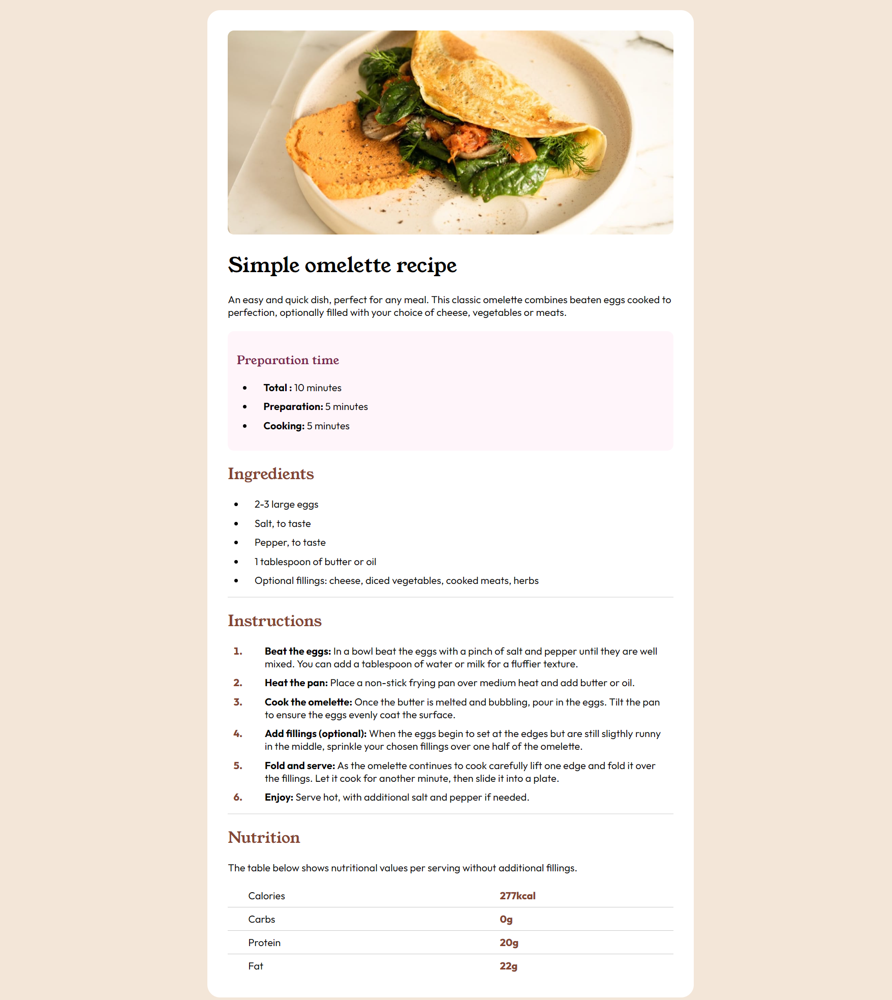

# Frontend Mentor - Recipe page solution

This is a solution to the [Recipe page challenge on Frontend Mentor](https://www.frontendmentor.io/challenges/recipe-page-KiTsR8QQKm). Frontend Mentor challenges help you improve your coding skills by building realistic projects.

## Table of contents

- [Overview](#overview)
  - [The challenge](#the-challenge)
  - [Screenshot](#screenshot)
  - [Links](#links)
- [My process](#my-process)
  - [Built with](#built-with)
  - [What I learned](#what-i-learned)
  - [Continued development](#continued-development)
  - [Useful resources](#useful-resources)
- [Author](#author)
- [Acknowledgments](#acknowledgments)

## Overview
A simple but fun project with lots of tiny changes in the design as you create properties for the doc elements. It was not difficult but it required some research to find the solution. 

### Screenshot

### Links

- Solution URL: [Add solution URL here](https://your-solution-url.com)
- Live Site URL: [Add live site URL here](https://your-live-site-url.com)

## My process
I start with creating the wireframe of the HTML doc, plan my semantic elements and I style it from bigger blocks to smaller elements, top to bottom. I try to use relative elements as much as possible to have a responsive outcome.  

### Built with

- Semantic HTML5 markup
- CSS custom properties
- Flexbox
- CSS Grid
- Mobile-first workflow

### What I learned

This project was a good practice for the lists and table properties. 

### Continued development

I try to learn to be simple and more efficient in code. 

### Useful resources

I used no resources for this project except of the usual w3school search for properties.

## Author

- Frontend Mentor - [@monicaivanov](https://www.frontendmentor.io/profile/monicaivanov)

## Acknowledgments

Congratulations to me for finishing my 4th project. Yuppy! Dont forget to rest and have fun!
